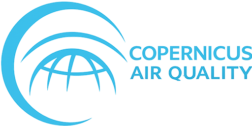

<div align="center">
    
# Copernicus CAMS Air Quality 
### copernicus atmosphere monitoring service
# Home Assistant Integration




[](https://www.buymeacoffee.com/janfajessen)
[](https://www.patreon.com/janfajessen)
<!--[](https://ko-fi.com/janfajessen)
[](https://github.com/sponsors/janfajessen)
[](https://paypal.me/janfajessen)-->

</div>

A Home Assistant integration providing real-time air quality data and 4-day forecasts powered by [Copernicus CAMS](https://www.copernicus.eu/en/services/cams) (ECMWF) via the free [Open-Meteo Air Quality API](https://open-meteo.com/en/docs/air-quality-api). No API key required. Works anywhere in the world.

---

## Here's what genuinely sets it apart:

- **Saharan dust** — actually quite rare, you're right that most integrations skip it. Worth keeping as a differentiator, especially for southern Europe during calima episodes.
- **3 sensors per variable (current + daily max + time of max)** — most integrations only expose the current value. Having the daily peak and when it occurred is genuinely useful for health decisions.
- **24-hour forecast as an attribute on every current sensor** — not just today's value but the next 24 hours inline, usable directly in templates and automations without extra entities.
- **European AQI (CITEAIR) calculated locally** — many integrations either don't include AQI at all, or use the US EPA scale which is less relevant for European users. Composite index (1–6 CITEAIR scale) calculated from PM2.5, PM10, NO2 and O3
- **Map picker in setup** — most custom integrations ask for raw lat/lon coordinates. The interactive pin makes it accessible to non-technical users.
- **Multiple locations from one integration** — each instance is a separate device, so you can monitor home, office, a school, etc. cleanly.
- **Pollen + pollutants + UV in one device** — competing integrations usually cover only one category. This one groups everything under a single device per location. 11 measured variables, particulates, gases, UV radiation and pollen
- **Zero dependencies** — no external Python packages, just HA's built-in aiohttp. Easier to install and less likely to break on HA updates.
- **Translations** — 49 Multilingual Home Assistant languagues

---

## Measured Variables

| Variable | Unit | Notes |
|---|---|---|
| PM10 | µg/m³ | Coarse particulates |
| PM2.5 | µg/m³ | Fine particulates |
| Dust | µg/m³ | Saharan dust surface concentration |
| Ozone (O₃) | µg/m³ | Tropospheric ozone |
| Nitrogen Dioxide (NO₂) | µg/m³ | Traffic-related pollution |
| Sulphur Dioxide (SO₂) | µg/m³ | Industrial pollution |
| UV Index | — | Current UV radiation |
| UV Index Clear Sky | — | UV under clear-sky conditions |
| Birch Pollen | grains/m³ | Europe only |
| Grass Pollen | grains/m³ | Europe only |
| Olive Pollen | grains/m³ | Europe only |
| **European AQI** | 1–6 | Calculated composite index |

---

## Installation

### Via HACS (recommended)

1. Open HACS → Integrations → ⋮ → Custom repositories
2. Add `https://github.com/janfajessen/copernicus_cams_air_quality` as **Integration**
3. Search for **Copernicus CAMS Air Quality** and install
4. Restart Home Assistant


### Manual

1. Copy the `copernicus_cams_air_quality` folder into `config/custom_components/`
2. Restart Home Assistant

---

## Configuration

1. Go to **Settings → Devices & Services → Add Integration**
2. Search for **Copernicus CAMS Air Quality**
3. A setup form appears with two fields:
   - **Location name** — any name you like, e.g. *Home*, *Office*, *Barcelona*
   - **Location** — an interactive map; drag the pin to your exact location
4. Click **Submit**

The integration uses your Home Assistant default coordinates as the starting position on the map. You can add as many locations as you want by repeating the process.

> **Note:** Pollen data (birch, grass, olive) is only available for European locations. Sensors for unavailable variables will show as *unavailable* — this is expected and not an error.

---

## Sensors Created

For each of the 11 variables, three sensor entities are created:

| Entity | Example | Description |
|---|---|---|
| `sensor.home_pm10_current` | 28.4 µg/m³ | Current hourly value |
| `sensor.home_pm10_max` | 41.2 µg/m³ | Daily maximum |
| `sensor.home_pm10_max_time` | 2026-04-20T14:00 | Time of daily maximum |

Every `_current` sensor also exposes a `forecast_24h` attribute containing the next 24 hourly values as a list.

The European AQI sensor (`sensor.home_aqi_european`) uses the following scale:

| Value | Label |
|---|---|
| 1 | Excellent |
| 2 | Good |
| 3 | Fair |
| 4 | Poor |
| 5 | Very Poor |
| 6 | Extremely Poor |

---

## Automations & Scripts

### Alert when PM2.5 exceeds WHO guideline

```yaml
automation:
  - alias: "Air Quality: High PM2.5 Alert"
    trigger:
      - platform: numeric_state
        entity_id: sensor.home_pm2_5_current
        above: 15
    action:
      - service: notify.mobile_app
        data:
          title: "⚠️ High PM2.5"
          message: >
            PM2.5 is {{ states('sensor.home_pm2_5_current') }} µg/m³
            (daily max: {{ states('sensor.home_pm2_5_max') }} µg/m³).
            Consider closing windows.
```

---

### Alert when European AQI reaches Poor or worse

```yaml
automation:
  - alias: "Air Quality: AQI Poor Alert"
    trigger:
      - platform: numeric_state
        entity_id: sensor.home_aqi_european
        above: 3.5
    action:
      - service: notify.mobile_app
        data:
          title: "🔴 Poor Air Quality"
          message: >
            European AQI is {{ states('sensor.home_aqi_european') }}/6.
            Avoid prolonged outdoor activity.
```

---

### Morning air quality briefing via Telegram

```yaml
automation:
  - alias: "Air Quality: Daily Morning Briefing"
    trigger:
      - platform: time
        at: "08:00:00"
    action:
      - service: notify.telegram
        data:
          message: >
            🌍 Morning Air Quality – Home

            PM2.5:  {{ states('sensor.home_pm2_5_current') | float(0) | round(1) }} µg/m³
            PM10:   {{ states('sensor.home_pm10_current') | float(0) | round(1) }} µg/m³
            Ozone:  {{ states('sensor.home_ozone_current') | float(0) | round(1) }} µg/m³
            NO₂:    {{ states('sensor.home_no2_current') | float(0) | round(1) }} µg/m³
            UV:     {{ states('sensor.home_uv_index_current') | float(0) | round(1) }}
            AQI:    {{ states('sensor.home_aqi_european') }}/6

            
            ✅ Air quality is good today.
            
            🟡 Air quality is acceptable.
            
            🔴 Air quality is poor — limit outdoor exposure.
            
```

---

### UV protection reminder

```yaml
automation:
  - alias: "Air Quality: UV Protection Reminder"
    trigger:
      - platform: numeric_state
        entity_id: sensor.home_uv_index_current
        above: 5
    condition:
      - condition: time
        after: "09:00:00"
        before: "18:00:00"
    action:
      - service: notify.mobile_app
        data:
          title: "☀️ UV Index {{ states('sensor.home_uv_index_current') }}"
          message: >
            
            Apply SPF 50+, wear protective clothing, avoid midday sun.
            Apply SPF 50+, seek shade during midday hours.
            Apply SPF 30+, wear sunglasses.
            Apply SPF 15+ if spending time outdoors.
            
```

---

### Pollen alert for allergy sufferers

```yaml
automation:
  - alias: "Air Quality: High Pollen Alert"
    trigger:
      - platform: numeric_state
        entity_id: sensor.home_grass_current
        above: 100
    action:
      - service: notify.mobile_app
        data:
          title: "🌾 High Grass Pollen"
          message: >
            Grass pollen is {{ states('sensor.home_grass_current') }} grains/m³.
            Keep windows closed and shower after being outdoors.
```

---

### Script: full air quality report as persistent notification

```yaml
script:
  air_quality_report:
    alias: "Generate Air Quality Report"
    sequence:
      - service: persistent_notification.create
        data:
          title: "Air Quality Report – Home"
          notification_id: air_quality_report
          message: >
            Generated: {{ now().strftime('%Y-%m-%d %H:%M') }}

            PARTICULATES
            PM2.5:  {{ states('sensor.home_pm2_5_current') | float(0) | round(1) }} µg/m³  (max today: {{ states('sensor.home_pm2_5_max') | float(0) | round(1) }} at {{ states('sensor.home_pm2_5_max_time') }})
            PM10:   {{ states('sensor.home_pm10_current') | float(0) | round(1) }} µg/m³  (max today: {{ states('sensor.home_pm10_max') | float(0) | round(1) }} at {{ states('sensor.home_pm10_max_time') }})
            Dust:   {{ states('sensor.home_dust_current') | float(0) | round(1) }} µg/m³

            GASES
            Ozone:  {{ states('sensor.home_ozone_current') | float(0) | round(1) }} µg/m³
            NO₂:    {{ states('sensor.home_no2_current') | float(0) | round(1) }} µg/m³
            SO₂:    {{ states('sensor.home_so2_current') | float(0) | round(1) }} µg/m³

            UV RADIATION
            UV Index:          {{ states('sensor.home_uv_index_current') | float(0) | round(1) }}
            UV Index (clear):  {{ states('sensor.home_uv_cs_current') | float(0) | round(1) }}

            POLLEN (Europe)
            Birch:  {{ states('sensor.home_birch_current') | float(0) | round(0) }} grains/m³
            Grass:  {{ states('sensor.home_grass_current') | float(0) | round(0) }} grains/m³
            Olive:  {{ states('sensor.home_olive_current') | float(0) | round(0) }} grains/m³

            COMPOSITE INDEX
            European AQI: {{ states('sensor.home_aqi_european') }}/6
            
            Excellent
            Good
            Fair
            Poor — reduce outdoor activity
            Very Poor — avoid outdoor activity
            Extremely Poor — stay indoors
            
```

---

### Lovelace markdown card

Paste this into a **Markdown** card on your dashboard for a quick overview:

```yaml
type: markdown
content: >
  ## 🌍 Air Quality – Home

  | | Current | Max today |
  |---|---|---|
  | PM2.5 | {{ states('sensor.home_pm2_5_current') }} µg/m³ | {{ states('sensor.home_pm2_5_max') }} µg/m³ |
  | PM10 | {{ states('sensor.home_pm10_current') }} µg/m³ | {{ states('sensor.home_pm10_max') }} µg/m³ |
  | Ozone | {{ states('sensor.home_ozone_current') }} µg/m³ | {{ states('sensor.home_ozone_max') }} µg/m³ |
  | NO₂ | {{ states('sensor.home_no2_current') }} µg/m³ | {{ states('sensor.home_no2_max') }} µg/m³ |
  | UV Index | {{ states('sensor.home_uv_index_current') }} | {{ states('sensor.home_uv_index_max') }} |

  **European AQI: {{ states('sensor.home_aqi_european') }}/6**
  
  ✅ Good🟡 Fair🔴 Poor
```

---

## Data Source

- **API**: [Open-Meteo Air Quality API](https://open-meteo.com/en/docs/air-quality-api) — free, no API key required
- **Underlying model**: Copernicus CAMS (ECMWF)
- **License**: [CC BY 4.0](https://creativecommons.org/licenses/by/4.0/)
- **Update frequency**: hourly
- **Forecast horizon**: 4 days

---

## Troubleshooting

**Integration does not appear in the UI after restart**
Check that the folder is named exactly `copernicus_cams_air_quality` inside `custom_components/`.

**Sensors show `unavailable`**
Expected for pollen sensors outside Europe, or temporarily if the API is unreachable. The coordinator will retry on the next hourly cycle.

**Stale data**
Force a refresh by calling `homeassistant.update_entity` on any sensor of this integration, or wait for the next hourly update.

---

<div align="center">

</div>

## License

MIT — see [LICENSE](LICENSE)

## Author

[Jan Fajessen](https://github.com/janfajessen)
